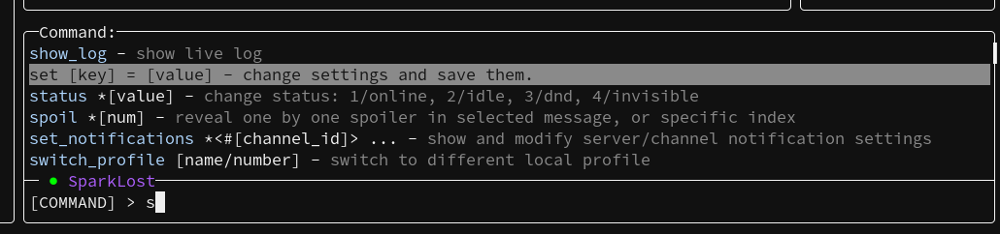
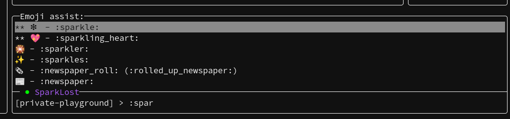
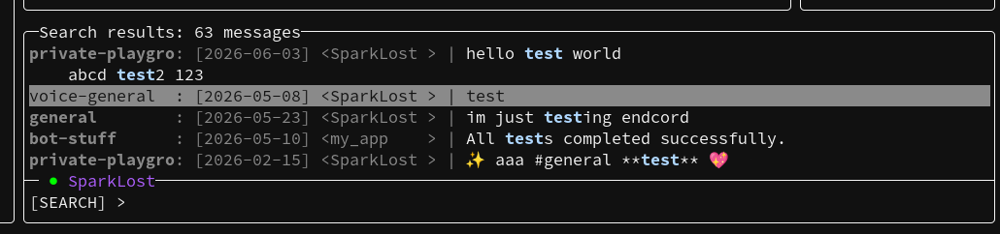
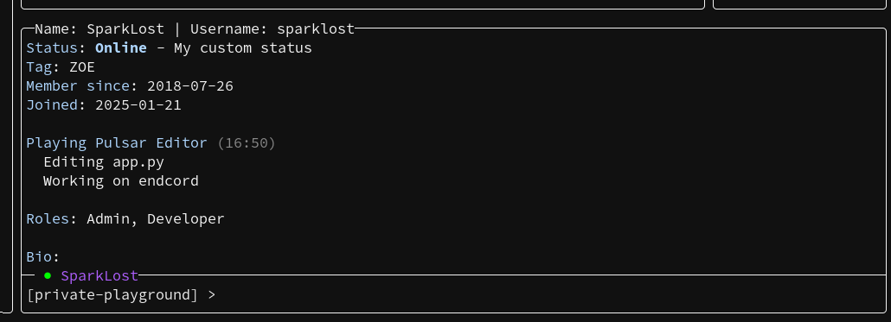
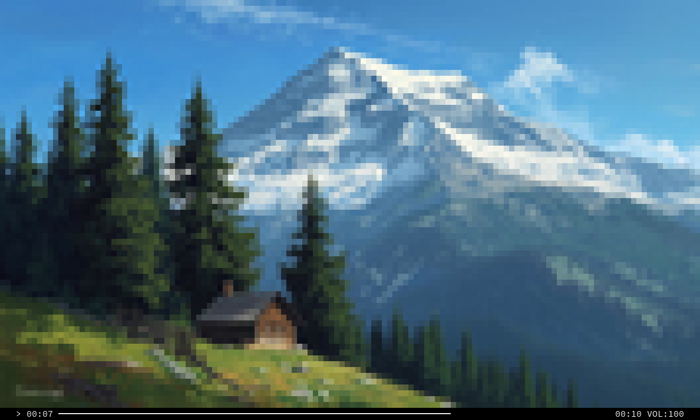
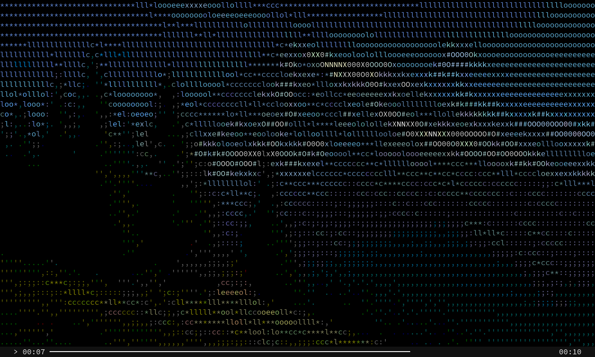
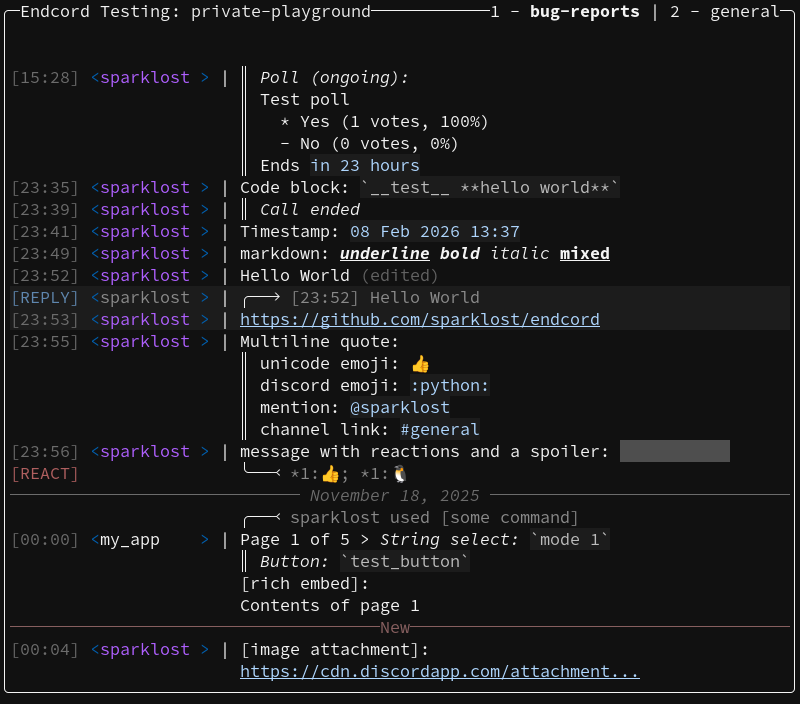

<a href="https://github.com/sparklost/endcord?tab=readme-ov-file#features">Features</a> |
<a href="https://github.com/sparklost/endcord?tab=readme-ov-file#configuration">Config</a> |
<a href="https://github.com/sparklost/endcord?tab=readme-ov-file#usage">Usage</a> |
<a href="https://github.com/sparklost/endcord?tab=readme-ov-file#installing">Installing</a> |
<a href="https://github.com/sparklost/endcord?tab=readme-ov-file#building">Building</a> |
<a href="https://github.com/sparklost/endcord/blob/main/docs/extensions.md">Extensions</a> |
<a href="https://github.com/sparklost/endcord/blob/main/.github/CONTRIBUTING.md">Contributing</a> |
<a href="https://github.com/sparklost/endcord?tab=readme-ov-file#faq">FAQ</a> |
<a href="https://discord.gg/judQSxw5K2">Discord</a>
  
<b>Standard theme:</b> 

 (Note: kitty protocol inline images can be setup with <a href="github.com/sparklost/endcord-image-inline">this</a> extension, and <a href="github.com/sparklost/endcord-image-emoji">this</a> for emoji)
  
<b>Client command assist above input line:</b> 

  
<b>Emoji assist while typing: 

  
<b>Message search:</b> 

  
<b>Viewing user profile:</b> 

  
<b>Video in built-in media player using "block" characters in truecolor:</b> 

  
<b>Video in built-in media player using ASCII art:</b> 

  
<b>IRC-like theme:</b> 

  

