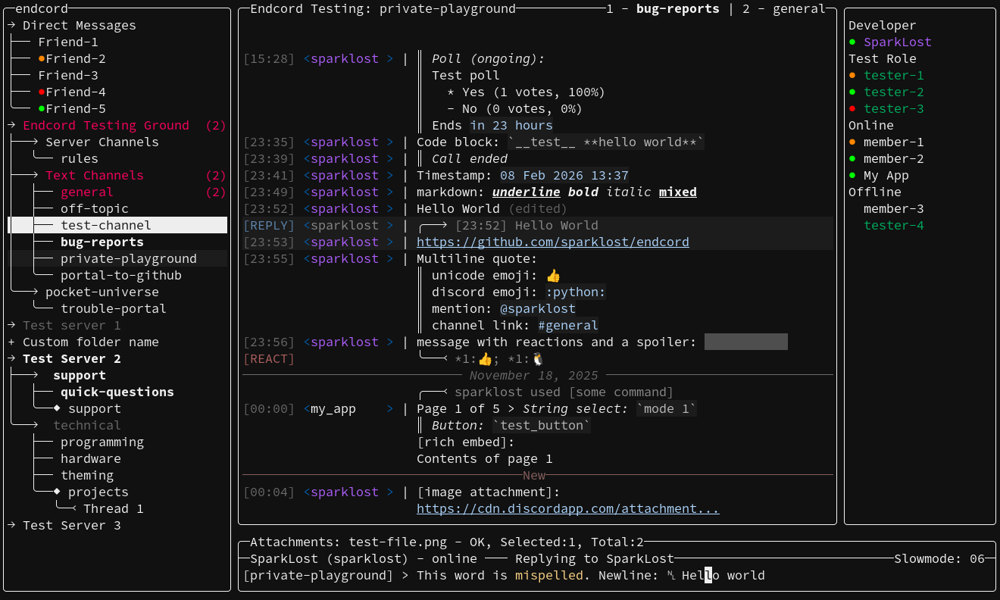

<h1>Endcord</h1>
<a href="https://github.com/sparklost/endcord?tab=readme-ov-file#features">Features</a> |
<a href="https://github.com/sparklost/endcord/blob/main/.github/screenshots.md">Screenshots</a> |
<a href="https://github.com/sparklost/endcord?tab=readme-ov-file#configuration">Config</a> |
<a href="https://github.com/sparklost/endcord?tab=readme-ov-file#usage">Usage</a> |
<a href="https://github.com/sparklost/endcord?tab=readme-ov-file#installing">Installing</a> |
<a href="https://github.com/sparklost/endcord?tab=readme-ov-file#building">Building</a> |
<a href="https://github.com/sparklost/endcord/blob/main/extensions.md">Extensions</a> |
<a href="https://github.com/sparklost/endcord/blob/main/.github/CONTRIBUTING.md">Contributing</a> |
<a href="https://github.com/sparklost/endcord?tab=readme-ov-file#faq">FAQ</a> |
<a href="https://discord.gg/judQSxw5K2">Discord</a>

Endcord is a third-party feature rich Discord client, running entirely in terminal.  
It is built with python and ncurses library, to deliver lightweight yet feature rich experience.  
Discord token is required in order to run endcord! see [Token](#token).  
[More screenshots](https://github.com/sparklost/endcord/blob/main/.github/screenshots.md).  

## Features
- Extremely low CPU and RAM usage (values greatly depend on number of servers and channels)
- Extension API
- Voice calls (WIP)
- Integrated RPC (only Rich Presence) and game detection
- Mouse controls
- Desktop notifications
- View images, gifs, videos, audio, stickers and YouTube with ASCII art or in external app
- Download/upload attachments
- Select message and: reply, edit, delete, go to replied, react, vote in a poll...
- Member list
- Search messages
- Client commands with history
- App commands and some interactions
- View user profile
- Channel tree
    - Correct channel order
    - Don't show hidden channels
    - Show muted channels as gray
    - Show unread channels as bold
    - Show channels with mention as red
    - Expand categories and servers
    - DMs in separate drop-down, show DM status
    - Forums, channel threads
    - Folders with custom naming
    - View channel or server info
- Show reactions, replied message, forwarded message
- Show embeds, attachment types and links, code blocks
- Spellchecking
- Advanced input line operations and ability to use external editor
- Tabs
- Assist when typing channel/username/role/emoji/sticker
- Search, preview and send gifs
- Record and send voice messages
- `s/old/new` replacement with extended regex
- Open link in browser
- Unlimited chat scrolling
- Keep deleted messages (OFF by default)
- Highlight messages with mentions
- Show who is typing and send 'typing' (ON by default)
- Change status and custom status
- Copy message text/url to clipboard
- Block/ignore/unblock, hide or mask blocked/ignored users messages
- No ghost pings (when client is running)
- Role colors in chat
- Change server/channel/category notification settings
- Partial markdown support (underline, bold, italic, spoiler, quote)
- Generate server invite link
- Theming
- Customizable status, title and prompt lines
- Customizable chat lines (message, newline, reaction, reply)
- Customizable colors and ASCII art
- Show discord emoji as `:emoji_name:`
- Show mentions as `@username`, `@role`, `#channel_name`
- Channel chat caching
- Remember last open channel and tree state
- Proxy support
- Can connect to spacebar
- Profile manager for multiple accounts
- Store token in system keyring
- Experimental windowed mode with tray icon
- Works in termux, with android notifications
- Lots of easter eggs

## Configuration
Settings, logs, state and themes location:
- On Linux: `~/.config/endcord/` or `$XDG_DATA_HOME/endcord/`  
- On Windows: `%USERPROFILE%/AppData/Local/endcord/`  
- On macOS: `~/Library/Application Support/endcord/`  

Run `endcord -h` or `endcord --help` to see available command arguments.  

### Providing config
Custom config path can be provided with `-c [PATH_TO_CONFIG]` flag.  
If config is not found at that path, default will be written.  
There can be missing entries in config, they will be filled with defaults.  

### Config options
Go to [configuration](configuration.md).

### Profile manager
Profile manager is used for easier switching between multiple accounts.  
It allows creating, editing, deleting and loading token for different accounts.  
Each token is saved as "profile", it has custom "name" as identifier, and last date of usage is also stored.  
Profiles can be saved either in keyring or as plaintext json.  
Keyring is OS managed secure storage for secrets (like passwords and tokens) - recommended.  
Plaintext means that tokens will be saved non-encrypted in `profiles.json` file in endcord settings directory.  
Use plaintext mode only if keyring is not working.  
If keyring is not available or not working, plaintext mode is used by default.  
Profile manager will always automatically load last used profile.  
Unless other profile is selected in manager TUI, or profile name is provided with `--profile` flag.  
Manager can be re-opened using `--manager` flag.  

### Token
Token is used to access Discord through your account without logging-in.  
It is required to use endcord.  
See [FAQ](#FAQ) for more info on obtaining your Discord token.  
After obtaining token, you can either:  
- Provide token in profile manager - recommended,
- Pass token to endcord as command argument: `endcord -t [YOUR_TOKEN]`.  
Note that if you use it as argument, it might get saved in your terminal history file.  
**Do not share your token!** Remove it form config before sharing it.  

### Keybinding
Keybindings are configured in separate section in `config.ini`.  
Key combinations are saved as integer codes, that can be generated by running `endcord -k`.  
`Alt+Key` codes are stored as string with format: `"ALT+[KEY]"`, where `[KEY]` is integer.
On Windows they are integers but `ALT+Key` string in keymap will still work.  
In xterm they are also integers (not the same as on Windows) and `ALT+Key` string in keymap will still work.  
`Ctrl+Shift+Key` combinations are not supported by most terminal emulators, but `Alt+Shift+Key` are.  
Keybindings can also be chained like this (maximum 2 bindings in chain, separated with `-`):  
`"25-97"` for `Ctrl+X-A` which means: press `Ctrl+X` then `A`,  
`"ALT+120-ALT+100"` for `Alt+X-Alt+D` and so on.  
To specify multiple keybindings for same action put them in a tuple, eg.: `(2, "25-97", "ALT+120")`.  
Switch tab keybinding is special - `NUM` is placeholder for 1-9 number keys, eg.:`ALT+NUM` or `ALT+120-NUM`.  

### Debug mode
Debug mode can be enabled with `-d` flag.  
It will cause extra messages to be written to log file.  
Endcord will periodically write to drive and log file will quickly grow in size.  
Log from previous run is renamed to `-prev` on each run and it is replaced.  
Current log can be accessed with `show_log` command or in config directory.

## Usage
### Keybindings
Navigating messages - `Arrow-Up/Down`  
Navigating channel tree - `Ctrl+Up/Down` *  
Open command palette - `Ctrl+/`  
Insert newline - `Ctrl+N`  
Scroll back to bottom - `Ctrl+H`  
Expand selected categories and servers - `Ctrl+Space` *  
Enter selected channel - `Ctrl+Space`  
Reply to selected message - `Ctrl+R`  
Edit selected message - `Ctrl+E`  
Delete selected message - `Ctrl+D`  
Toggle reply ping when replying - `Ctrl+P`  
Open external editor to type message in it - `Alt+E`  
Add reaction with assist to selected message - `Ctrl+L`  
Show reactions details for selected message - `Alt+W`  
Go to replied message - `Ctrl+G`  
View user profile (selected message) - `Alt+P`  
View channel info (selected in tree) - `Alt+I`  
Show summaries for current channel - `Alt+S`  
Search messages in current channel - `Ctrl+F`  
Search gifs - `Alt+F`  
Copy message to clipboard - `Ctrl+B` *  
Open selected link in browser - `Ctrl+O` *  
Download selected attachment - `Ctrl+W`  
View selected attached media (image, gif, video, audio) - `Ctrl+V` *  
Upload attachments - `Ctrl+U`  
Preview selected file in upload assist or when searching gif - `Alt+V`  
Cancel all downloads/uploads - `Ctrl+X`  
Cancel selected attachment - `Ctrl+K`  
Reveal one spoiler in selected messages - `Alt+T`  
Paste text - terminal paste, usually `Ctrl+Shift+V`  
Undo input line - `Alt+Z`  
Redo input line - `Alt+Shift+Z`  
Show pinned messages in current channel - `Alt+N`  
Un/collapse channel with threads in tree - `Alt+H`  
Join/leave selected thread in tree - `Alt+J`  
Cycle status (online/away/DnD/invisible) - `Alt+D`  
Open selected post in forum - `Enter`  
Copy selected message url to clipboard - `Alt+U`  
Copy selected channel (in tree) url to clipboard - `Alt+Shift+U`  
Go to channel/message mentioned in selected message - `Alt+G`  
Toggle channel tabbed (pinned) state - `Ctrl+T`  
Switch to tab: `Alt+NUM` (`NUM`: 1-9 in number row, not numeric keypad)  
Media player: quit - `escape`, pause - `Space`, seek - `Left/Right`, replay - `Z`  
Cancel action, leave media viewer - `Escape`  
Quit - `Ctrl+C`  
\* - Rebound keybinding on some OS, see [OS specific keybindings](#os-specific-keybindings).  

### Mouse controls
Scroll up/down in all windows  
Single click to select in all windows, in tree also: un/collapse  
Double click in:  
Tree - or enter channel  
Extra window - select item  
Member list - view member profile  
Input line - select a word  
Double click in chat:  
On message time - start replying to message  
On message reply line - go to that message  
On username - view profile  
On reaction - toggle that reaction  
On URL - open media / download file / open in browser  
On spoiler - reveal that spoiler  

### Channel Tree
If tree object has `>` before the object name, it means it has sub-objects (its drop-down).  
Objects can be un/collapsed with `Ctrl+Space`. Channels with threads can be un/collapsed on `Alt+E`.  
Channel with threads are collapsed by default.  
Thread can be joined or left (toggle) on `Alt+J`.  

### Newline
Newline can be added to input line by pressing `Ctrl+N`.  
To keep text in one line it is represented as `␤` only in input line.  
When message is sent, it will be split in newlines properly.

### Chat scrolling
When last message in chat buffer is selected, buffer will be extended with older messages.  
If number of messages in buffer exceeds `limit_chat_buffer` value in config, chat will be trimmed on the opposite side.  
If latest message is missing, then buffer can be extended with newer messages by selecting first message in buffer.  

### Downloading / Open in browser
Downloading and opening links have similar mechanism:  
If there is one item, download will start immediately / open in browser.  
If there are multiple items, it will prompt for an item index (starts from 1).  
Items can be:  
- Links and attachments for 'open in browser'  
- Only attachments for 'download'.  
Links are counted first. Items are counted from start to end of the message, in order.  
Downloads are parallel. `Ctrl+X` will cancel ALL downloads and attachments, with a confirmation prompt.  

### Uploading
Uploading is initiated by pressing `Ctrl+U`. Previously typed content will be cached.  
Type path to file that should be uploaded and press enter. Cached content will be restored.  
Wait until file is uploaded and then send the message. Multiple files can be added this way.  
Path can be absolute or relative, and has autocomplete on `tab` key.  
If file size exceeds discord's limit it will not be added to the sent message.  
Attachments can be navigated with `Ctrl+Left/Right` in extra line (above status line).  
`Ctrl+X` will cancel ALL downloads and attachments, with a confirmation prompt.  
`Ctrl+K` will cancel selected attachment (and stop upload) and remove it from attachments list.

### Extra window and member list navigation
Same controls for navigating in extra window and member list:
`Alt+Up/Down` - Go up/down  
`Alt+Enter` - perform action on selected line (depends on context)  
Extra window navigation is prioritized over member list.  
Extra window is drawn for viewing:
- User profile info - from selected message (`Alt+P`)
- Channel/server info - from selected tree channel (`Alt+I`)
- Summaries for currently open channel (`Alt+S`), `Alt+Enter` will jump to first message in chat on that summary topic.
- Search and search results (`Ctrl+F`), `Alt+Enter` or enter with no typed text will jump to selected message.  
- Pinned messages (`Alt+N`),  `Alt+Enter` or enter with no typed text will jump to selected message.  
`Alt+Enter` in member list will show user profile of the selected member.  

### Assist with mention, role, channel, emoji, sticker
When typing eg. username prepended with `@`, assist will open as extra window with search results for typed text after `@` (search is case-insensitive).  
Assist triggers are (the first character): `@username`, `@role`, `#channel`, `:emoji:`, `;sticker;`.  
Press `Esc` to stop assist. Re-type trigger to start it again.  
Navigation: `Alt+Up/Down` - Go up/down, `Alt+Enter` or `Enter` - insert selected item.  
When inserted in input line, item will usually be shown as `<some_numbers>` - that is intended - do not alter it.  
Stickers and emojis are sorted into packs, and will be shown as `pack name - emoji/sticker name`, and search is performed on that string.  
Sticker will also be added to message text and removed when sending.  

### Adding/Removing reactions
To start reaction assist, press `Alt+E`.  
Then type emoji name prepended with `:`, just like with regular assist then enter.  
If reaction is already present it will be +1. Reaction is removed if current account already reacted (reactions are toggled).  
To add/remove one of already present reactions, only type its index (starts from 1).  
If this account reacted to the message, that reaction will have `*` prepended to reaction count.  

### Escape key priority order
Stop recording, close extra window, stop replying, everything else.

### Client-side commands
Press `Ctrl+/` to switch to command mode. Command mode has its own assist but can also trigger regular assist. [Commands list](commands.md).

### App commands
App commands assist is initiated by typing `/` at the start of input line.  
Pressing Enter will insert current assist selection.  
If selection is `EXECUTE` then pressing enter will try to send that command.  
App commands format is like this:  
`/[bot_name] [command] [subcommand/group] [subcommand_after_group] --[option_name]=[option_value]`  
`[bot_name]` is case-insensitive, and `_` must be used instead space.  
Space is used only to separate command segments, except in option_value with quotes.  
`[subcommand/group]` is either single subcommand or subcommand group, and is optional.  
Subcommand group must be followed by `[subcommand_after_group]`, which is subcommand selected from this group.  
`[option_value]` can be put in `""`, useful when it has spaces in the value. Options are sometimes not required.  
If option is of type "attachment", it can be left without value, but attachment must be provided (with `Ctrl+U`) before sending the command.  
If `skip_app_command_assist = True` in config, then all app commands are shown in initial assist after `/`. Then, inserting command will also insert bot_name.  

### Emoji
To add default emoji in message just type its name or alias, like this: `:thumbs_up:`  
For now, there is no emoji assist, but it is planned.  
Emoji names can be found [here](https://unicode.org/emoji/charts/full-emoji-list.html) and aliases [here](https://www.webfx.com/tools/emoji-cheat-sheet/).  

# s/ replacements with regex
Type `s/old/new` as a message and send it to edit your last message by replacing `old` with `new`.  
Note that this is using regex. And is very simmilar to how sed works.  
Features other than full regex support:
- Full regex support
- Append `/g` to repeat for all matches
- Append `/i` to enable case-insensitive search
- `&` in the replacement portion represents the entire matched pattern from the search portion.
- `\NUMBER` in the replacement portion represents capture groups in the search portion

# Tabs
Tabs are "pinned" channels in channel cache, and are counted in channel cache limit.  
Currently active channel can be un/tabbed with `Alt+B`.  
To switch to any tabbed channel use `Alt+NUM`, where `NUM` is tab number (use keys in number row).

### Forums
Forums in tree can be opened just like a channel (`Ctrl+Space`).  
Select post and `Enter` to open it. While in a thread run `toggle_thread` command to join it.
Posts are treated same as threads in channel tree, but only participated posts will be shown.  
If there are no posts in the forum (this will happen when switching to forum in never opened server), switch to some channel in the same server, (client must subscribe to some channel so discord can send thread list sync).

### Redraw
If UI ever gets messed up, redraw it with command: press `Ctrl+/` then type `redraw`, and press `Enter` to execute it.  

### Terminal size
Recommended terminal size for proper viewing is minimum 120 columns and 32 rows, for default theme.

### RPC
For now RPC only supports Rich Presence over IPC, which means no subscriptions, join requests, lobby, etc.  
Because of this, some apps may not connect, misbehave or even error. If that happens, disable RPC in config.  
If this happens, more info about what is going on can be found in log, when endcord is in debug mode.  

### Game detection
Game detection service is ON by default and can be disabled in config.  
Occasionally, it will download ~10MB json file, clean it up, and save it as ~1MB file. When this happens there will be small spike in CPU usage at startup.  

### Theming
Custom theme path can be provided with `-c [PATH_TO_THEME]` flag or in `config.ini`.
Theme can also be changed in `config.ini` under section `[theme]`.  
Loading order: argument theme -> `config.ini` theme -> builtin default theme. There can be missing settings.  
If theme is not found at provided path, default theme will be written to it.  
If only file name is provided, without `.ini` extension, theme will be searched in `Themes` directory, see [Configuration](#configuration) for path.  
Default themes are assumed to be drawn on dark terminal background (preferably black).  

### Media support
Very large number of image and video formats are supported thanks to pillow and PyAV.  
All the visual media is converted to ASCII art that can be additionally configured in [theme](configuration.md).  
But there is also setting in config to open media in external app (cross-system, will use default system app for that file format).  
"endcord-lite" (without voice calls and ASCII media support), can be built by specifying `--lite` flag to build script. Lite version is significantly smaller, cant make voice calls, but still can open media in external app.  

### OS specific keybindings
Some keybindings are used by terminals or OS itself, so they are by default rebound to something else.  
#### Windows:  
Expand selected categories and servers - `Ctrl+A`  
Copy message to clipboard - `Alt+L`  
View attached media (image, gif, video, audio) - `Alt+Y`  
#### macOS:
Navigating channel tree - `Shift+Up/Down`  
Open link in browser - `Alt+O`  

### Experimental windowed mode
This mode entirely replaces curses with pygame-ce GUI library. This means Endcord runs in its own window, not in terminal, but UI remains terminal-like.  
Tray icon will also be enabled, so closing window will only minimize it to tray.  
Keybinding remain the same, but all codes are like on Linux, so old keybinding codes may not work on Windows.  
If using external editor, use some with graphical interface. TUI editors will not work, as this is no longer in terminal.  
Building with nuitka on python >=3.13 will create executable that segfaults! Building with pyinstaller is not recommended because it generates huge binary.  
You can toggle experimental mode bu running: `uv run build.py --experimental`.  
Then run endcord from source: `uv run main.py`.  
After first run in experimental mode, extra config will be generated in endcord config path in file called `pgcurses.json`. More info in [configuration](configuration.md).

### Spacebar and other custom hosts
Connecting to [Spacebar](https://github.com/spacebarchat) or any other discord-like instance can be configured in `config.ini`. Set `custom_host = ` to preferred host domain, like `old.server.spacebar.chat`. Set to `None` to use default host (`discord.com`).  
Then endcord will try to connect to that host instead discord. Token is different on different hosts!  
Only connecting to spacebar instances is known to work, but endcord may crash at any time. Further, each host may have different spam filters, so **use at your own risk** still applies.

### Termux
Endcord does work under termux, but some keybindings dont (`Ctrl/Alt+Space`). It is recommended to rebind them in endcord config or use endcord in desktop environment (like `openbox`) in a terminal emulator with xterm256-colors (like `alacritty`) and with Termux:X11 app.  
Endcord cant be built in termux, so to run it: first install python >= 3.12 and `uv`, then clone this repo, cd to folder and run it from source: `uv run main.py` (it will take some time to download and build numpy and orjson). To skip waiting for some dependencies, or if it fails building them run: `uv remove numpy soundcard soundfile orjson`.
To enable android notifications simply run `pkg install termux-api` and install Termux:API app. Vibration is disabled by default, to enable it: run endcord at least once, then in Termux:Api notification settings enable vibration for endcord ntifications.  
Notifications will work as ling as endcord is running, so it might be necessary for termux to "Acquire wakelock".  

### Extensions warning
Extensions are enabled by default, and can be toggled in settings. But extension can modify almost everything in endcord, and can access your tokens. **Use extensions at your own risk!**  
To prevent extension injection (malware can modify endcord config and inject extension in extensions directory) - which is very unlikely, there is build script option: `--disable-extensions` which disables extension loading in the code itself, overriding config.

## Installing
### Linux
- Pre-built binaries (built with nuitka using clang) are available in releases  
    Binaries are built on Ubuntu-like distro. **Locally built binaries can be smaller, thus starts faster**.
- From AUR:
    - `yay -S endcord` - full version with media support, larger executable
    - `yay -S endcord-lite` - lite version without voice calls and media support
    - `-git` versions will build from source, with latest changes
- [Build](#building) endcord, then copy built executable to system:  
    `sudo cp dist/endcord /usr/local/bin/`

Optional dependencies:
- `xclip` - Clipboard support on X11
- `wl-clipboard` - Clipboard support on Wayland
- `aspell` - Spellchecking (and `aspell-en` dictionary)
- `yt-dlp` - youtube support
- `mpv` - Play youtube videos in native player (non-ascii)
- `libsecret` - Store token in system keyring (`gnome-keyring` is also required, with `dbus` as dependency)
- `libappindicator-gtk3` - Tray support under wayland, for [experimental windowed mode](#experimental-windowed-mode) only.

### Windows
Install [windows terminal](https://github.com/microsoft/terminal) or [cmder](https://github.com/cmderdev/cmder), or any other modern terminal.  
- Pre-built binaries (built with nuitka using clang) are available in releases
- [Build](#building) endcord, standalone executable can be found in `./dist/endcord.exe`
Run exe from wt or cmder. In cmder settings, under "Font" check "Treat font height as device units", so font is always monospace.  
If built with experimental windowed mode, terminal is not required to use endcord.  
Optional dependency, for spellchecking: [aspell](https://github.com/adamyg/aspell-win32). It is expected to be installed in `C:\Program Files (x86)\`. If it is not, please open an issue and provide the actual install path. Alongside with base aspell, dictionary must be installed, even en_US.  
Emoji and Ctrl+key support depends on terminal.  
To enable youtube support, download [yt-dlp](https://github.com/yt-dlp/yt-dlp) and provide its executable path in config.  

### macOS
- Pre-built binaries (built with nuitka using clang) are available in releases
- [Build](#building) endcord, standalone executable can be found in `./dist/`.  
Optional dependency, for spellchecking: [aspell](https://github.com/adamyg/aspell-win32). Can be installed with: `brew aspell`.  
Never tested on macOS. Feedback is welcome.

## Disclaimer
> [!WARNING]
> Using third-party client is against Discord's Terms of Service and may cause your account to be banned!  
> **Use endcord at your own risk!**
> For more info see [FAQ](#FAQ).

## Building
To see all build script options, run: `uv run build.py -h`.  
To build endcord-lite, add `--lite` flag. No voice calls and ascii media, slightly less RAM usage, smaller executable, faster startup.  
To build into directory, not as a single executable, add `--onedir` flag. Will speed up startup.  
To build with Nuitka, add `--nuitka` flag. Optimized, smaller executable, long compile time. See [Nuitka](#nuitka) for more info.  
If compiler is not available, or built binary is failing, try building with `--nocython`, which will produce slightly less optimized binaries.  
To toggle [experimental windowed mode](#experimental-windowed-mode) run: `uv run build.py --toggle-experimental`.  
If you want to build without `orjson` (uses rust), run `uv remove orjson` for the first time, before running anything else. This will make it fallback to standard json (more CPU usage by game detection). Optionally it can use `ujson`, run `uv add ujson` to install it.  

### Linux
1. Clone this repository: `git clone https://github.com/sparklost/endcord.git`
2. Install [uv](https://docs.astral.sh/uv/getting-started/installation/)
3. `cd endcord`
4. run build script: `uv run build.py`  

### Windows
1. Install [Python](https://www.python.org/) 3.13 or later
2. Install [uv](https://docs.astral.sh/uv/getting-started/installation/)
3. Clone this repository, unzip it
4. Open terminal, cd to unzipped folder
5. run build script: `uv run build.py`

### macOS
1. Install [Python](https://www.python.org/) 3.13 or later
2. Clone this repository, unzip it
3. Open terminal, cd to unzipped folder
4. run build script: `uv run build.py`

### Nuitka
To enable building with Nuitka, add `--nuitka` flag (takes a long time).  
Nuitka built binaries are much more optimized and can play videos at higher framerate.  
Optionally, add `--clang` flag to tell nuitka to compile using llvm, which might run even faster.  
Nuitka requirements:
- on Linux: GCC or clang and `patchelf` package
- on Windows: [Visual Studio 2022](https://www.visualstudio.com/en-us/downloads/download-visual-studio-vs.aspx) or mingw (will be downloaded by nuitka)
- on macOS install XCode via Apple Store

### Free-threaded Python
Endcord does work with free-threaded python, and it significantly improves media player performance with large video resolutions, by allowing decoding, video and sound to be played in separate threads, completely removing crackling sound when playing on high "terminal resolution".  
But currently building does not work in this mode, nuitka [doesn't support free-threaded mode](<https://github.com/Nuitka/Nuitka/issues/3062>) yet.  
Anyway, to run it from source:  
First install python with uv: `uv python install 3.14t`, it must be >= 3.14t (because some libraries dont have free-threaded support for < 3.14).  
Install dependencies: `uv sync --python 3.14t --group media`  
Run main.py: `uv run --python 3.14t main.py`  

## FAQ
### Obtaining your Discord token
1. Open Discord in browser.
2. Open developer tools (`F12` or `Ctrl+Shift+I` on Chrome and Firefox).
3. Go to the `Network` tab then refresh the page.
4. In the 'Filter URLs' text box, search `discord.com/api`.
5. Click on any filtered entry. On the right side, switch to `Header` tab, look for `Authorization`.
6. Copy value of `Authorization: ...` found under `Request Headers` (right click -> Copy Value)
7. This is your discord token. **Do not share it!**

### To further decrease probability of getting banned
Endcord does its best to avoid causing any suspicious activity, so using it as-is is pretty much enough, but most important steps are:
- Do not use endcord to perform any out-of-ordinary actions (i.e. self-bots). Third party clients can sometimes trip anti-spam heuristic algorithm for catching self-bots.
- Do not use endcord at the same time with the client from which you coped token from, it might be it suspicios to have 2 clients using same token at the same time.
- Increase `limit_channel_cache` in config - so REST API is not called on every channel switch. This will also slightly increase RAM and CPU usage.
- `anonymous` mode in `client_properties` setting might be more risky than `default` mode.
- Do not set invalid `custom_user_agent` setting, and try to match it with your OS.
- If endcord hasnt been updated in a while, set `custom_user_agent` to the one found in API requests in offiial Discord client.
- Endcord automatically refreshes token stored in keyring or plaintext, so there is no need to update it manually unless token is revoked.
Less important steps is to decrease REST API calls, which might have little to no effect:
- Discord REST API is called (most notably) each time client is started, when channel is changed, app command is sent and message is seen or sent. It would be best to not abuse these actions in order to reduce REST API calls.
- Do not leave endcord on busy channels running in background.
- Do not repeatedly view user profiles.
- Sending ack (when channel is marked as seen) is throttled by endcord to 5s (configurable).
- Disable `rpc_external` in config - it calls REST API for fetching external resources for Rich Presence, but it shouldn't be critical.
- Disable `send_typing` in config - it calls REST API every 7s when typing, but it shouldn't be critical.

### What if you get banned?
You can write to Discord TNS team: https://dis.gd/request.  
If you did something particular with endcord that caused the ban, open an issue describing what that is. Maybe that can be prevented or other users can be warned.  

### Debug files
Anonymized data that might help in debugging is saved in `Debug` directory, see [Configuration](#configuration) for path.  
All channel and server names, topics, descriptions are replaced. All channel and server IDs are added to random number and hashed, so they are irreversible changed, and will be different on each run.

### Some role colors are wrong
This is an [issue](https://github.com/python/cpython/issues/119138) with cpython ncurses API. It is ignoring color pairs with ID larger than 255. This means only 255 color pairs can actually be used. Only role colors can reach this limit, because they are initialized last.
This will be updated in endcord when cpython issue is resolved.

### Status sign in tree has no color when selected or active
Same reason as above, colors will be added when curses bug is fixed.  

### No emoji
If emoji are drawn as empty box or similar, it means emoji are not supported by this terminal. In that case, enable `emoji_as_text` in `config.ini`.

### Sticker cannot be opened
If the message says it "cannot be opened", then this is lottie sticker. These stickers have special vector way of drawing animations and will not be supported.

### Restore locally hidden channels
Locally hidden channels can be restored by removing them in `hidden_channels.json`, see [Configuration](#configuration) for path.  

### Must send at least N messages in official client
The client will refuse to send message in newly-created DM channels. This measure is to prevent triggering discords spam filter.

### Messages wont send and in log it says error code 400
In config, disable `send_x_super_properties`. These properties may be used in spam detection so disable them only if necessary, and report the issue.

### No notification sound
Custom notification sound can be set in config: `custom_notification_sound = /path/to/file.mp3`.

### Some keybindings don't work with non-Latin keyboard layouts (non-ascii)
This happens with `Alt+Key` keybindings, but may happen with other modifiers too. That happens because terminal emulators translate pressed keys with non-Latin keyboard layouts to Unicode. So when `ALT+B` is pressed, but Greek layout is used, endcord will receive `ALT+β`.  
But this also means that it can be added to keybinding config, instead byte, provide character itself eg.: `β` or `ALT+β`.  
See [keybinding](#keybinding) for instructions on how to add multiple keybindings for same action.

### If some keybindings still dont work
Its probably terminal emulator sending different key codes than those in default settings. Check this by running endcord with `-k` or `--keybinding` to start keybinding resolver.  
Then press key combination and see printed code. Put this code in settings to use it.  
This mostly happens with `Ctrl+Arrow` and `Alt+Arrow` combinations, on some non-standard terminal emulators like kitty or cmder.

### No colors in headless Linux tty
If there are no colors in Linux tty (but there should be), endcord can run inside [fbterm](https://salsa.debian.org/debian/fbterm).  
Follow [fbterm setup instructions](https://wiki.archlinux.org/title/Fbterm#Installation), then set environment variable: `export TERM=fbterm` and run endcord.  
Note: keybinding `Ctrl+Up/Down/Left/Right` does not work in tty.  

### Adding desktop launcher on Linux
Simply make launcher execute `endcord` or `endcord-lite`, endcord will deal with starting terminal. It will prefer `$TERMINAL` environment variable, then fallback to some most popular terminal emulators.

### Legacy theme
Endcord default theme uses non-standard characters to display som TUI elements, and these characters may not work on some terminals, or look weird wih some fonts.  
If that happens, use [legacy theme](themes/legacy.ini). It is used by default on windows.  

### Virus scanners are flagging endcord binaries as malware
These are false positives. Binaries are built using nuitka, the problem is that its regularly used by other people to distribute malware. So some AVs flag all Nuitka-built binaries as malware. [Ref](https://nuitka.net/user-documentation/common-issue-solutions.html#windows-virus-scanners).  
Its the same with all other python freezing tools, like pyinstaller, cx-freeze...  
So to run endcord, either allow it in anti-virus/windows-defender or run it from source.  

### Support
Open an issue in [issue tracker](https://github.com/sparklost/endcord/issues).  
Or, if you don't have a github account, want more interactive support, to share a theme or have a question: [Endcord Discord Server](https://discord.gg/judQSxw5K2).

## Planned features
Go to [TODO](todo.txt).

### Features that will not be added
Following features have significant risk of triggering discords spam filter, and may cause account to be limited or even banned:  
Sending friend request, opening new DM, creating new thread, scriptable command macros, anything payment related.  

Therefore, they will NOT be implemented in endcord.  
