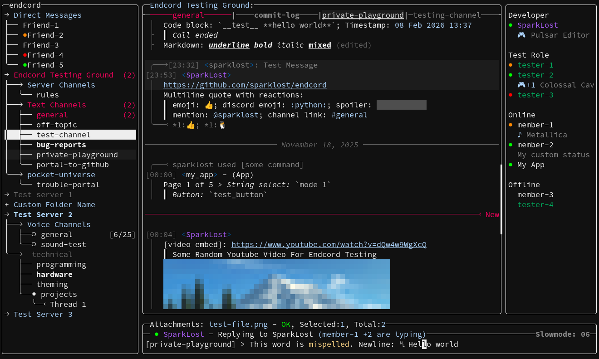

<h1>Endcord</h1>
<a href="https://github.com/sparklost/endcord?tab=readme-ov-file#features">Features</a> |
<a href="https://github.com/sparklost/endcord/blob/main/.github/screenshots.md">Screenshots</a> |
<a href="https://github.com/sparklost/endcord?tab=readme-ov-file#configuration">Config</a> |
<a href="https://github.com/sparklost/endcord?tab=readme-ov-file#usage">Usage</a> |
<a href="https://github.com/sparklost/endcord?tab=readme-ov-file#installing">Installing</a> |
<a href="https://github.com/sparklost/endcord?tab=readme-ov-file#building">Building</a> |
<a href="https://github.com/sparklost/endcord/blob/main/docs/extensions.md">Extensions</a> |
<a href="https://github.com/sparklost/endcord/blob/main/.github/CONTRIBUTING.md">Contributing</a> |
<a href="https://github.com/sparklost/endcord?tab=readme-ov-file#faq">FAQ</a> |
<a href="https://discord.gg/judQSxw5K2">Discord</a>

Endcord is a third-party feature rich Discord client, running entirely in terminal.  
It is built with Python (this [doesnt mean its slow](#note-on-python-performance-misconceptions)) and ncurses library, to deliver lightweight yet feature rich experience.  
[More screenshots](https://github.com/sparklost/endcord/blob/main/.github/screenshots.md).  

## Features
- Extremely low CPU and RAM usage (values greatly depend on number of servers and channels)
- Voice calls (WIP)
- Vim-mode
- Integrated RPC (only Rich Presence) and game detection
- Mouse controls
- Login with email, 2fa, QR code, or paste token
- Desktop notifications
- View images, gifs, videos, audio, stickers and YouTube with ASCII art or in external app
- Download/upload attachments
- Select message and: reply, edit, delete, go to replied, react, vote in a poll...
- Member list
- Search messages
- Client commands with history, custom commands can be bound to key
- App commands and some interactions
- View user profile
- Channel tree
    - Correct channel order
    - Don't show hidden channels
    - Show muted channels as gray
    - Show unread channels as bold
    - Show channels with mention as red with number of mentions
    - Collapse categories and servers
    - DMs in separate drop-down, show DM status
    - Forums, channel threads
    - Folders with custom naming
    - View channel or server info
- Show reactions, replied message, forwarded message
- Show embeds, attachment types and links, code blocks
- Spellchecking
- Advanced input line operations and ability to use external editor
- Tabs
- Assist when typing channel/username/role/emoji/sticker
- Search, preview and send gifs
- Record and send voice messages
- `s/old/new` replacement with extended regex
- Open link in browser
- Unlimited chat scrolling
- Keep deleted messages (OFF by default)
- Highlight messages with mentions
- Show who is typing and send 'typing' (ON by default)
- Change status and custom status
- Copy message text/url to clipboard
- Block/ignore/unblock, hide or mask blocked/ignored users messages
- No ghost pings (when client is running)
- Role colors in chat
- Change server/channel/category notification settings
- Partial markdown support (underline, bold, italic, spoiler, quote)
- Generate server invite link
- Theming
- Customizable status, title and prompt lines
- Customizable chat lines (message, newline, reaction, reply)
- Customizable colors and ASCII art
- Show discord emoji as `:emoji_name:` and view them in media player
- Show mentions as `@username`, `@role`, `#channel_name`
- Channel chat caching
- Extension API, builtin extensions search
- Macro keybindings support (bind key to chain of commands)
- Proxy support
- Profile manager for multiple accounts
- Store token in system keyring
- Experimental windowed mode with tray icon
- Works in termux, with android notifications
- Auto endcord and extensions check for updates
- Run bots, with interactions
- Lots of easter eggs

## Configuration
Settings, logs, state and themes location:
- On Linux: `~/.config/endcord/` or `$XDG_DATA_HOME/endcord/`  
- On Windows: `%USERPROFILE%/AppData/Local/endcord/`  
- On macOS: `~/Library/Application Support/endcord/`  
- Or run `open_config_dir` command inside endcord.

Run `endcord -h` or `endcord --help` to see available command arguments.  

### Providing config
Custom config path can be provided with `-c [PATH_TO_CONFIG]` flag.  
If config is not found at that path, default will be written.  
There can be missing entries in config, they will be filled with defaults.  

### Config options
Go to [configuration](docs/configuration.md).

### Profile manager
Profile manager is used for login and easier switching between multiple accounts.  
It allows logging in with standard email and password, 2fa, QR code, or to paste token.  
Each account is saved as "profile", it has custom "name" as identifier, and last date of usage is also stored.  
Profiles can be saved either in keyring or as plaintext json.  
Keyring is OS managed secure storage for secrets (like passwords and tokens) - recommended.  
Plaintext means that tokens will be saved non-encrypted in `profiles.json` file in endcord settings directory.  
Use plaintext mode only if keyring is not working.  
If keyring is not available or not working, plaintext mode is used by default.  
Profile manager will always automatically load last used profile.  
Unless other profile is selected in manager TUI, or profile name is provided with `--profile` flag.  
Manager can be re-opened using `--manager` flag.  

### Logging in
- Email/phone number and password - credentials are used only while logging in and will never be kept in storage
- Scan QR code - note that some terminals may fail to render QR code
- Token - used to access Discord through your account without logging-in
- Token as an argument: `endcord -t [YOUR_TOKEN]`, but note that it might get saved in your terminal history file  
Email or QR code login may fail because captcha is requested by Discord. In that case first login and complete captcha through official client, from same IP address, then try again. If it still fails, then youll have to use token method.  
If you want to verify what is happening with credentials, look in profile_manager.py and auth.py.  
**Do not share your token!**    

### Configuring keybindings
Go to [keybindings](docs/keybindings.md#configuring-keybindings).

### Debug mode
Debug mode can be enabled with `-d` flag.  
It will cause extra messages to be written to log file.  
Endcord will periodically write to drive and log file will quickly grow in size.  
Log from previous run is renamed to `-prev` on each run and it is replaced.  
Current log can be accessed with `show_log` command or in config directory.

## Usage
### Controls and keybindings
Go to [keybindings](docs/keybindings.md).

### Channel Tree
If tree object has `>` before the object name, it means it has sub-objects (its drop-down).  
Objects can be un/collapsed with `Ctrl+Space`. Channels with threads can be un/collapsed on `Alt+E`.  
Channel with threads are collapsed by default.  
Thread can be joined or left (toggle) on `Alt+J`.  

### Newline
Newline can be added to input line by pressing `Ctrl+N`.  
To keep text in one line it is represented as `␤` only in input line.  
When message is sent, it will be split in newlines properly.

### Chat scrolling
When last message in chat buffer is selected, buffer will be extended with older messages.  
If number of messages in buffer exceeds `limit_chat_buffer` value in config, chat will be trimmed on the opposite side.  
If latest message is missing, then buffer can be extended with newer messages by selecting first message in buffer.  

### Downloading / Open in browser
Downloading and opening links have similar mechanism:  
If there is one item, download will start immediately / open in browser.  
If there are multiple items, it will prompt for an item index (starts from 1).  
Items can be:  
- Links and attachments for 'open in browser'  
- Only attachments for 'download'.  
Links are counted first. Items are counted from start to end of the message, in order.  
Downloads are parallel. `Ctrl+X` will cancel ALL downloads and attachments, with a confirmation prompt.  

### Uploading
Uploading is initiated by pressing `Ctrl+U`. Previously typed content will be cached.  
If `native_file_dialog` is set to `True` in config, it will open system native file dialog instead.  
Type path to file that should be uploaded and press enter. Cached content will be restored.  
Wait until file is uploaded and then send the message. Multiple files can be added this way.  
Path can be absolute or relative, and has autocomplete on `tab` key.  
If file size exceeds discord's limit it will not be added to the sent message.  
Attachments can be navigated with `Ctrl+Left/Right` in extra line (above status line).  
`Ctrl+X` will cancel ALL downloads and attachments, with a confirmation prompt.  
`Ctrl+K` will cancel selected attachment (and stop upload) and remove it from attachments list.

### Extra window and member list navigation
Same controls for navigating in extra window and member list:
`Alt+Up/Down` - Go up/down  
`Alt+Enter` - perform action on selected line (depends on context)  
Extra window navigation is prioritized over member list.  
Extra window is drawn for viewing:
- User profile info - from selected message (`Alt+P`)
- Channel/server info - from selected tree channel (`Alt+I`)
- Summaries for currently open channel (`Alt+S`), `Alt+Enter` will jump to first message in chat on that summary topic.
- Search and search results (`Ctrl+F`), `Alt+Enter` or enter with no typed text will jump to selected message.  
- Pinned messages (`Alt+N`),  `Alt+Enter` or enter with no typed text will jump to selected message.  
`Alt+Enter` in member list will show user profile of the selected member.  

### Assist with mention, role, channel, emoji, sticker
When typing eg. username prepended with `@`, assist will open as extra window with search results for typed text after `@` (search is case-insensitive).  
Assist triggers are (the first character): `@username`, `@role`, `#channel`, `:emoji:`, `;sticker;`.  
Press `Esc` to stop assist. Re-type trigger to start it again.  
Navigation: `Alt+Up/Down` - Go up/down, `Alt+Enter` or `Enter` - insert selected item.  
When inserted in input line, item will usually be shown as `<some_numbers>` - that is intended - do not alter it.  
Stickers and emoji are sorted into packs, and will be shown as `pack name - emoji/sticker name`, and search is performed on that string.  
Sticker will also be added to message text and removed when sending.  

### Adding/Removing reactions
To start reaction assist, press `Alt+E`.  
Then type emoji name prepended with `:`, just like with regular assist then enter.  
If reaction is already present it will be +1. Reaction is removed if current account already reacted (reactions are toggled).  
To add/remove one of already present reactions, only type its index (starts from 1).  
If this account reacted to the message, that reaction will have `*` prepended to reaction count.  

### Escape key priority order
Stop recording, close extra window, stop replying, everything else.

### Client-side commands
Press `Ctrl+/` to switch to command mode. Command mode has its own assist but can also trigger regular assist. [Commands list](docs/commands.md).

### App commands
App commands assist is initiated by typing `/` at the start of input line.  
Pressing Enter will insert current assist selection.  
If selection is `EXECUTE` then pressing enter will try to send that command.  
App commands format is like this:  
`/[bot_name] [command] [subcommand/group] [subcommand_after_group] --[option_name]=[option_value]`  
`[bot_name]` is case-insensitive, and `_` must be used instead space.  
Space is used only to separate command segments, except in option_value with quotes.  
`[subcommand/group]` is either single subcommand or subcommand group, and is optional.  
Subcommand group must be followed by `[subcommand_after_group]`, which is subcommand selected from this group.  
`[option_value]` can be put in `""`, useful when it has spaces in the value. Options are sometimes not required.  
If option is of type "attachment", it can be left without value, but attachment must be provided (with `Ctrl+U`) before sending the command.  
If `skip_app_command_assist = True` in config, then all app commands are shown in initial assist after `/`. Then, inserting command will also insert bot_name.  

### Emoji
To add default emoji in message just type its name or alias, like this: `:thumbs_up:`  
For now, there is no emoji assist, but it is planned.  
Emoji names can be found [here](https://unicode.org/emoji/charts/full-emoji-list.html) and aliases [here](https://www.webfx.com/tools/emoji-cheat-sheet/).  

# s/ replacements with regex
Type `s/old/new` as a message and send it to edit your last message by replacing `old` with `new`.  
Note that this is using regex. And is very similar to how sed works.  
Features other than full regex support:
- Full regex support
- Append `/g` to repeat for all matches
- Append `/i` to enable case-insensitive search
- `&` in the replacement portion represents the entire matched pattern from the search portion.
- `\NUMBER` in the replacement portion represents capture groups in the search portion

# Tabs
Tabs are "pinned" channels in channel cache, and are counted in channel cache limit.  
Currently active channel can be un/tabbed with `Alt+B`.  
To switch to any tabbed channel use `Alt+NUM`, where `NUM` is tab number (use keys in number row).

### Forums
Forums in tree can be opened just like a channel (`Ctrl+Space`).  
Select post and `Enter` to open it. While in a thread run `toggle_thread` command to join it.
Posts are treated same as threads in channel tree, but only participated posts will be shown.  
If there are no posts in the forum (this will happen when switching to forum in never opened server), switch to some channel in the same server, (client must subscribe to some channel so discord can send thread list sync).

### Redraw
If UI ever gets messed up, redraw it with command: press `Ctrl+/` then type `redraw`, and press `Enter` to execute it.  

### Terminal size
Recommended terminal size for proper viewing is minimum 120 columns and 32 rows, for default theme.

### RPC
For now RPC only supports Rich Presence over IPC, which means no subscriptions, join requests, lobby, etc.  
Because of this, some apps may not connect, misbehave or even error. If that happens, disable RPC in config.  
If this happens, more info about what is going on can be found in log, when endcord is in debug mode.  

### Game detection
Game detection service is ON by default and can be disabled in config.  
Occasionally, it will download ~10MB json file, clean it up, and save it as ~1MB file. When this happens there will be small spike in CPU usage at startup.  
Games can be blacklisted using `game_detection_blacklist` command.  

### Theming
Custom theme path can be provided with `-c [PATH_TO_THEME]` flag or in `config.ini`.
Theme can also be changed in `config.ini` under section `[theme]`.  
Loading order: argument theme -> `config.ini` theme -> builtin default theme. There can be missing settings.  
If theme is not found at provided path, default theme will be written to it.  
If only file name is provided, without `.ini` extension, theme will be searched in `Themes` directory, see [Configuration](#configuration) for path.  
Default themes are assumed to be drawn on dark terminal background (preferably black).  

### Vim mode
Vim-like mode can be enabled in the config by setting `vim_mode = True`. Keybindings list can be found [here](docs/keybindings.md#vim-mode-keybindings).  
In vim mode there are currently 2 modes: "normal" and "insert".  
Normal mode is the default mode and allows using many "single-key" keybindings, fully disabling the input line.  
As usual, press `i` to switch to insert mode and `Esc` to leave it. Insert mode will allow typing in input line.  
Pressing enter in insert mode will not send the message but insert newline instead.  
Note that original keybindings are not disabled and can be used from any mode. Any keybinding collisions are resolved in favor of vim mode bindings.  

### Media support
Very large number of image and video formats are supported thanks to pillow and PyAV.  
All the visual media is converted to ASCII art that can be additionally configured in [theme](docs/configuration.md#theme).  
But there is also setting in config to open media in external app (cross-system, will use default system app for that file format).  
"endcord-lite" (without voice calls and ASCII media support), can be built by specifying `--lite` flag to build script. Lite version is significantly smaller, cant make voice calls, but still can open media in external app.  

### Experimental windowed mode
This mode entirely replaces curses with pygame-ce GUI library. This means Endcord runs in its own window, not in terminal, but UI remains terminal-like.  
Tray icon will also be enabled, so closing window will only minimize it to tray.  
Keybinding remain the same, but all codes are like on Linux, so old keybinding codes may not work on Windows.  
If using external editor, use editor with graphical interface. TUI editors will not work, as this is no longer in terminal.  
Also, endcord built-in media player will not work because its standalone TUI thats not using curses. All meda will be opened in native player.  
Building with nuitka on python >=3.13 will create executable that segfaults! Building with pyinstaller is not recommended because it generates huge binary.  
You can toggle experimental mode by running: `python build.py --experimental`.  
Then run endcord from source: `uv run main.py`.  
After first run in experimental mode, extra config will be generated in endcord config path in file called `pgcurses.json`. More info in [configuration](docs/configuration.md).

### Custom hosts
Connecting to other discord-like instance can be configured in `config.ini` by setting `custom_host = ` to preferred host domain. Set to `None` to use default host (`discord.com`) or use `--custom-host=` command argument.  
Ebut endcord may crash at any time. Further, each host may have different spam filters, so **use at your own risk** still applies.  
Wether endcord will work or crash depends on hosts api implementation, the more different from discord it is, greater is the rish of a crash.  If endcord crashes its hosts fault. Do not report bugs related to this.

### Termux
Endcord does work under termux, but some keybindings don't (`Ctrl/Alt+Space`). It is recommended to rebind them in endcord config or use endcord in desktop environment (like `openbox`) in a terminal emulator with xterm256-colors (like `alacritty`) and with Termux:X11 app.  
Endcord cant be built in termux, so to run it: first install python >= 3.12 and `uv`, then clone this repo, cd to folder and run it from source: `uv run main.py` (it will take some time to download and build numpy and orjson). To skip waiting for some dependencies, or if it fails building them run: `uv remove numpy soundcard soundfile orjson pynacl pycryptodome psutil`.
To enable android notifications simply run `pkg install termux-api` and install Termux:API app. Vibration is disabled by default, to enable it: run endcord at least once, then in Termux:Api notification settings enable vibration for endcord notifications.  
Notifications will work as ling as endcord is running, so it might be necessary for termux to "Acquire wakelock".  

### Extensions warning
Extensions are enabled by default, and can be toggled in settings. But extension can modify almost everything in endcord, and can access your tokens. **Use extensions at your own risk!**  
To prevent extension injection (malware can modify endcord config and inject extension in extensions directory) - which is very unlikely, there is build script option: `--disable-extensions` which disables extension loading in the code itself, overriding config.

## Installing
### Linux
- Pre-built binaries (built with nuitka using clang) are available in releases  
    Binaries are built on Ubuntu-like distro. **Locally built binaries can be smaller, thus starts faster**.
- Arch Linux (AUR):
    - `yay -S endcord` - full version with media support, larger executable
    - `yay -S endcord-lite` - lite version without voice calls and media support
    - `-git` versions will build from source, with latest changes
- Gentoo Linux (GURU):
    - `emerge --ask net-im/endcord` - full version installed from source (not built)
    - `emerge --ask net-im/endcord-bin` - prebuilt full binary
- [Build](#building) endcord, then copy built executable to system:  
    `sudo cp dist/endcord /usr/local/bin/`
- Install script (installs binary from latest release or updates existing):
    - `bash -c "$(curl -fsSL https://raw.githubusercontent.com/sparklost/endcord/main/tools/install.sh)"`
    - Append ` -- --lite` to install lite instead
    - Append ` -- --uninstall` to uninstall

Optional dependencies:
- `xclip` - Clipboard support on X11
- `wl-clipboard` - Clipboard support on Wayland
- `yazi` / `zenity` / `kdialog` - File dialog when uploading
- `aspell` - Spellchecking (and `aspell-en` dictionary)
- `git` - Install and update extensions from other sources than github
- `yt-dlp` - youtube support
- `mpv` - Play youtube videos in native player (non-ascii)
- `libsecret` - Store token in system keyring (`gnome-keyring` is also required, with `dbus` as dependency)
- `libappindicator-gtk3` - Tray support under wayland, for [experimental windowed mode](#experimental-windowed-mode) only.
- `imagemagick` - To make notification images round; only needed for endcord-lite.

### Windows
- Pre-built binaries (built with nuitka using clang) are available in releases
- [Build](#building) endcord, standalone executable can be found in `./dist/endcord.exe`  

Install [WezTerm](https://wezterm.org/) (recommended), [windows terminal](https://github.com/microsoft/terminal), [cmder](https://github.com/cmderdev/cmder), or any other modern terminal. And run exe from there. If built with experimental windowed mode, terminal is not required to use endcord.  
WezTerm proved to introduce the least drawing issues.  
Cmder settings: "Mouse" > check "Send mouse events to console" and "Mark/Copy" > uncheck "Intelligent mode", and set "Main console font" and "Alternative font" to same monospace font.  
Emoji are known to work only with WezTerm but many will fail to draw and mess-up the UI, so its best to set `emoji_as_text = True` in config.  
Optional dependency for spellchecking: [aspell](https://github.com/adamyg/aspell-win32). It is expected to be installed in `C:\Program Files (x86)\`. Alongside with base aspell, dictionary must be installed, even en_US.  

### macOS
- Pre-built binaries (built with nuitka using clang) are available in releases
- [Build](#building) endcord, standalone executable can be found in `./dist/`.  
- Install script (installs binary from latest release or updates existing):
    - `bash -c "$(curl -fsSL https://raw.githubusercontent.com/sparklost/endcord/main/tools/install.sh)"`
    - Append ` -- --lite` to install lite instead
    - Append ` -- --uninstall` to uninstall
Optional dependency for spellchecking: `aspell`. Can be installed with: `brew aspell`.  

## Disclaimer
> [!WARNING]
> Using third-party client is against Discord's Terms of Service and may cause your account to be banned!  
> **Use endcord at your own risk!**  
> For more info see [FAQ](#FAQ).  

Third party endcord forks may add features that can lead to account ban, or contain malicious code, cause instability, especially if they include LLM generated/modified code.

## Building
To see all build script options, run: `python build.py -h`.  
To build endcord-lite, add `--lite` flag. No voice calls and ascii media, slightly less RAM usage, smaller executable, faster startup.  
To build into directory, not as a single executable, add `--onedir` flag. Will speed up startup.  
To build with Nuitka, add `--nuitka` flag. More optimized, smaller executable, long compile time. See [Nuitka](#nuitka) for more info.  
If compiler is not available, or built binary is failing, try building with `--nocython`, which will produce slightly less optimized binaries.  
To toggle [experimental windowed mode](#experimental-windowed-mode) run: `python build.py --toggle-experimental`.  

### Linux
1. Clone this repository: `git clone https://github.com/sparklost/endcord.git`
2. Install [uv](https://docs.astral.sh/uv/getting-started/installation/)
3. `cd endcord`
4. run build script: `python build.py`  

### Windows
1. Install [Python](https://www.python.org/) 3.12 or later
2. Install [uv](https://docs.astral.sh/uv/getting-started/installation/)
3. Clone this repository, unzip it
4. Open terminal, cd to unzipped folder
5. run build script: `python build.py`

### macOS
1. Install [Python](https://www.python.org/) 3.12 or later
2. Clone this repository, unzip it
3. Open terminal, cd to unzipped folder
4. run build script: `python build.py`

### Nuitka
To enable building with Nuitka, add `--nuitka` flag (takes a long time).  
Nuitka built binaries are much more optimized and can play videos at higher framerate.  
Optionally, add `--clang` flag to tell nuitka to compile using llvm, which might run even faster.  
Nuitka requirements:
- on Linux: GCC or clang and `patchelf` package
- on Windows: [Visual Studio 2022](https://www.visualstudio.com/en-us/downloads/download-visual-studio-vs.aspx) or mingw (will be downloaded by nuitka)
- on macOS install XCode via Apple Store

### Free-threaded Python
Endcord does work with free-threaded python (3.14 only), and it significantly improves media player performance with large video resolutions, by allowing decoding, video and sound playing to be run in separate CPU threads, completely removing crackling sound when playing on high "terminal resolution".  
This comes at the cost of much larger binary, increased CPU and RAM usage.  
Currently nuitka [doesn't support free-threaded mode](<https://github.com/Nuitka/Nuitka/issues/3062>) yet. Pyinstaller (without `--nutka` flag) does build it successfully.  
To make it use freethreaded python run `python build.py` (not `uv`!) with `--freethreaded` arument.  

### Building without orjson
If you want to build without `orjson` (uses rust), run `uv remove orjson` for the first time, before running anything else.  
This will make it fallback to standard json (more CPU usage by game detection).  
Optionally it can use `ujson`, run `uv add ujson` to install it.  
Then force build.py to skip auto-python setup: `uv run -p 3.13 build.py`, and add other preferred arguments after build.py.  

## FAQ
### Obtaining your Discord token
1. Open Discord in browser.
2. Open developer tools (`F12` or `Ctrl+Shift+I` on Chrome and Firefox).
3. Go to the `Network` tab then refresh the page.
4. In the 'Filter URLs' text box, search `discord.com/api`.
5. Click on any filtered entry. On the right side, switch to `Header` tab, look for `Authorization`.
6. Copy value of `Authorization: ...` found under `Request Headers` (right click -> Copy Value)
7. This is your discord token. **Do not share it!**

### To further decrease probability of getting banned
Endcord does its best to avoid causing any suspicious activity, so using it as-is is pretty much enough, but most important steps are:
- Do not use endcord to perform any out-of-ordinary actions (i.e. self-bots). Third party clients can sometimes trip anti-spam heuristic algorithm for catching self-bots.
- Do not use endcord at the same time with the client from which you coped token from, it might be it suspicios to have 2 clients using same token at the same time.
- Do not use same token across different third party clients.
- Do not use `--token` flag, endcord automatically refreshes token stored with profile manager, so there is no need to update it manually.
- Increase `limit_channel_cache` in config - so REST API is not called on every channel switch. This will also slightly increase RAM and CPU usage.
- `anonymous` mode in `client_properties` setting might be more risky than `default` mode.
- If endcord hasnt been updated in a while, set `custom_user_agent` to the one found in API requests in official Discord client.
- Do not set invalid `custom_user_agent` setting, and try to match it with your OS.
- Do not use public proxy, like VPN or TOR.
Less important steps is to decrease REST API calls, which might have little to no effect:
- Discord REST API is called (most notably) each time client is started, when channel is changed, app command is sent and message is seen or sent. It would be best to not abuse these actions in order to reduce REST API calls.
- Do not leave endcord on busy channels running in background.
- Sending ack (when channel is marked as seen) is throttled by endcord to 5s (configurable).
- Disable `rpc_external` in config - it calls REST API for fetching external resources for Rich Presence, but it shouldn't be critical.
- Disable `send_typing` in config - it calls REST API every 7s when typing, but it shouldn't be critical.

### What if you get banned?
You can write to Discord TNS team: https://dis.gd/request.  
If you did something particular with endcord that caused the ban, open an issue describing what that is. Maybe that can be prevented or other users can be warned.  

### Debug files
Anonymized data that might help in debugging is saved in `Debug` directory, see [Configuration](#configuration) for path.  
All channel and server names, topics, descriptions are replaced. All channel and server IDs are added to random number and hashed, so they are irreversible changed, and will be different on each run.

### Note on Python performance misconceptions
Python is slower than languages like C or Rust, but in this use case it does not affect performance. Endcord is event-driven and network-bound not CPU-bound, so Python’s overhead is negligible (significantly reduced when built with nuitka). And all CPU-critical components are implemented in Cython. Python was chosen because it enables rapid development.

### Some role colors are wrong
This is an [issue](https://github.com/python/cpython/issues/119138) with cpython ncurses API. It is ignoring color pairs with ID larger than 255. This means only 255 color pairs can actually be used. Only role colors can reach this limit, because they are initialized last.
This will be updated in endcord when cpython issue is resolved.

### Status sign in tree has no color when selected or active
Same reason as above, colors will be added when curses bug is fixed.  

### No emoji
If emoji are drawn as empty box or similar, it means emoji are not supported by this terminal. In that case, enable `emoji_as_text` in `config.ini`.

### Sticker cannot be opened
If the message says it "cannot be opened", then this is lottie sticker. These stickers have special vector way of drawing animations and will not be supported.

### Restore locally hidden channels
Locally hidden channels can be restored by removing them in `hidden_channels.json`, see [Configuration](#configuration) for path.  

### Must send at least N messages in official client
The client will refuse to send message in newly-created DM channels. This measure is to prevent triggering discords spam filter.

### Messages wont send and in log it says error code 400
In config, disable `send_x_super_properties`. These properties may be used in spam detection so disable them only if necessary, and report the issue.

### No notification sound
Custom notification sound can be set in config: `custom_notification_sound = /path/to/file.mp3`.

### Some keybindings don't work with non-Latin keyboard layouts (non-ascii)
This happens with `Alt+Key` keybindings, but may happen with other modifiers too. That happens because terminal emulators translate pressed keys with non-Latin keyboard layouts to Unicode. So when `ALT+B` is pressed, but Greek layout is used, endcord will receive `ALT+β`.  
But this also means that it can be added to keybinding config, instead byte, provide character itself eg.: `β` or `ALT+β`.  
See [keybinding](#keybinding) for instructions on how to add multiple keybindings for same action.

### If some keybindings still don't work
Its probably terminal emulator sending different key codes than those in default settings. Check this by running endcord with `-k` or `--keybinding` to start keybinding resolver.  
Then press key combination and see printed code. Put this code in settings to use it.  
This mostly happens with `Ctrl+Arrow` and `Alt+Arrow` combinations, on some non-standard terminal emulators like kitty or cmder.

### Running in tty
If there are no colors in Linux tty (but there should be), endcord can run inside [fbterm](https://salsa.debian.org/debian/fbterm).  
Follow [fbterm setup instructions](https://wiki.archlinux.org/title/Fbterm#Installation), then set environment variable: `export TERM=fbterm` and run endcord.  
Some characters may fail to render so set `emoji_as_text = True` in config and `compact = True` in theme. Some theme characters should also be tweaked.  
Note: keybinding `Ctrl+Up/Down/Left/Right` does not work in tty, either rebind them or add custom keymap, or in `/etc/vconsole.conf`.  

### Adding desktop launcher on Linux
Simply make launcher execute `endcord` or `endcord-lite`, endcord will deal with starting terminal. It will prefer `$TERMINAL` environment variable, then fallback to some most popular terminal emulators.

### Legacy theme
Endcord default theme uses non-standard characters to display som TUI elements, and these characters may not work on some terminals, or look weird wih some fonts.  
If that happens, use [legacy theme](themes/legacy.ini). It is used by default on windows.  

### Virus scanners are flagging endcord binaries as malware
These are false positives. Binaries are built using nuitka, the problem is that its regularly used by other people to distribute malware. So some AVs flag all Nuitka-built binaries as malware. [Ref](https://nuitka.net/user-documentation/common-issue-solutions.html#windows-virus-scanners).  
Its the same with all other python freezing tools, like pyinstaller, cx-freeze...  
So to run endcord, either allow it in anti-virus/windows-defender or run it from source.  

### Support
Open an issue in [issue tracker](https://github.com/sparklost/endcord/issues).  
Or, if you don't have a github account, want more interactive support, to share a theme or have a question: [Endcord Discord Server](https://discord.gg/judQSxw5K2).

### Creating and maintaining package for Linux distribution
As endcord build script requires network access in order to install dependencies, it is impossible to use it to build endcord binaries for many distributions/repositories.  
If thats the case, custom build script must be made, guidelines and commands for writing such are available in [contributing.md](.github/CONTRIBUTING.md#build-steps-for-package-maintainers).  
After submitting a package to distributions package repository, open an issue here, so I can review it and add it to readme after it gets accepted.

## Planned features
Go to [TODO](todo.txt).

### Features that will not be added
Following features have significant risk of triggering discords spam filter, and may cause account to be limited or even banned:  
Sending friend request, opening new DM, creating new thread, editing profile, anything payment related.  

Therefore, they will NOT be implemented in endcord.  
